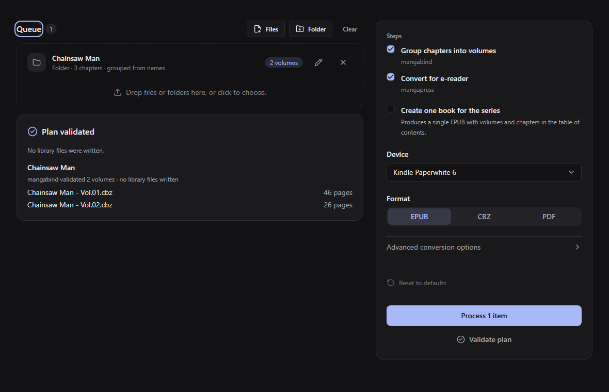

# Mangabound

<!-- Branding: add the finished Mangabound logo here. Placement and asset guidance: website/MEDIA.md. -->

Mangabound is a desktop app for organizing manga chapters into volumes and converting them into books for your e-reader. Choose how chapters are grouped and fine-tune page size, margins, and image quality for your device. Once processed, save your books locally or share them directly with KOReader over your local network.

[Download](https://github.com/gustavommcv/mangabound/releases) · [User guide](https://gustavommcv.github.io/mangabound/) · [Guia em português](https://gustavommcv.github.io/mangabound/pt-br/) · [Contribute](CONTRIBUTING.md)



_Interface example with Storybook sample data. The guide and screenshots follow `main`, which may be ahead of the latest release._

- Review and edit chapter-to-volume assignments before processing.
- Create EPUB, CBZ, or PDF books for devices such as Kindle, Kobo, and reMarkable, or use custom page dimensions.
- Produce separate volumes or combine a series into one book (EPUB only for now).
- Set book details, covers, and image-processing options.

## Download

Choose your package from [GitHub Releases](https://github.com/gustavommcv/mangabound/releases). Alpha releases are listed as **Pre-release**.

| Platform                         | Package                                   |
| -------------------------------- | ----------------------------------------- |
| Windows x64                      | `.Setup.exe` installer or portable `.zip` |
| macOS, Apple Silicon             | `.zip`                                    |
| Linux, Debian/Ubuntu family, x64 | `.deb`                                    |
| Linux, Fedora/RHEL family, x64   | `.rpm`                                    |
| Linux, Arch, x64                 | `.pkg.tar.zst`                            |

Mangabound is in **alpha**, and the installers are not yet code-signed. See the [installation guide](https://gustavommcv.github.io/mangabound/getting-started/installation/) for setup and download verification, and the [known limitations](https://gustavommcv.github.io/mangabound/getting-started/overview/#known-limitations) for current platform and feature restrictions.

## Get started

1. **Add your manga.** Drop chapter folders, a library of manga folders, or CBZ files into the queue.
2. **Choose how to organize and convert it.** Check the volumes, select your device and format, and adjust image settings if needed. Book details let you set each title's name, author, and language.
3. **Process, then save or share.** Follow the progress, save one book or all of them, or share with KOReader over your local network.

Your conversion settings are remembered between sessions. Unsaved books remain under **Ready books**, where you can reopen or delete a pending conversion.

See the [user guide](https://gustavommcv.github.io/mangabound/) for volume editing, single-book mode, custom dimensions, and sharing.

## Local processing

Mangabound accepts chapter folders and CBZ files. Finished books open in your system's default application.

Organization, conversion, and saving run on your computer. Online searches for volumes or an author are optional and use the title and selected work's metadata, not your manga pages. Network sharing runs only when enabled and stops when the app closes.

## Contributing

For bugs and suggestions, use the [issue templates](https://github.com/gustavommcv/mangabound/issues/new/choose). Read [CONTRIBUTING.md](CONTRIBUTING.md) and the [Code of Conduct](CODE_OF_CONDUCT.md) before contributing. Report suspected vulnerabilities privately as described in [SECURITY.md](SECURITY.md).

The [current priorities](docs/milestones.md#current-priorities) describe the remaining release and maintenance work, with a completion criterion for each item. Documentation, translations, reproducible bug reports, and platform testing are useful contributions too.

### Run from source

Development requirements:

- Node.js 24 LTS
- npm 11+
- `tar` (and `unzip` on Linux and macOS) for verified release extraction. On Windows run the npm scripts from PowerShell: the `tar` that ships with Git Bash breaks the toolchain step.

`main` is the latest state and can be ahead of what a release shipped. To build what a given release contains, check out its tag first (`git checkout v0.1.0-alpha.11`).

Install and run the development shell:

```text
npm ci
npm start
```

Run `npm run check` for the local quality gates, or `npm run storybook` to browse interface states without running a conversion. The [contributor guide](CONTRIBUTING.md) explains the tests, browser setup, packaged-app checks, and exact-commit CI requirement.

Development setup acquires and verifies the pinned converters under the ignored `vendor/toolchain/` directory. Installed packages already include them; the app does not download or update converters at runtime.

## Documentation

| Read this                                                          | To learn                                                                        |
| ------------------------------------------------------------------ | ------------------------------------------------------------------------------- |
| [Documentation Website](https://gustavommcv.github.io/mangabound/) | Official bilingual user guides, KOReader setup, and CLI reference (`website/`)  |
| [Architecture overview](docs/architecture.md)                      | How the code is layered, how a conversion runs end to end, where to change what |
| [Architecture decisions](docs/adr/README.md)                       | Why it is built this way, one short record per decision                         |
| [Contributing](CONTRIBUTING.md)                                    | The gates, the kinds of tests, Storybook, and how to open a pull request        |
| [Adding an online source](docs/adding-a-metadata-provider.md)      | The rules and the steps for offering another source of volume data              |
| [Current priorities and milestones](docs/milestones.md)            | Concrete pending work and the implementation history                            |
| [Release checklist](docs/release-checklist.md)                     | The basic release smoke test and checks for changed desktop integrations        |
| [Releasing](RELEASING.md)                                          | How to cut and publish a release, step by step                                  |

Bundled converters are pinned in `toolchain.lock.json`. Updating a pin is a separate, reviewed change; see [Updating the bundled tools](CONTRIBUTING.md#updating-the-bundled-tools).

## Credits

- **[mangabind](https://github.com/gustavommcv/mangabind)** handles chapter grouping and volume creation.
- **[mangapress](https://github.com/gustavommcv/mangapress)** processes pages and creates the finished books.
- **[MangaDex](https://mangadex.org)** provides optional volume and author metadata. Mangabound is free and ad-free; see the [provider guide](docs/adding-a-metadata-provider.md) for attribution and API requirements.
- **[Kindle Comic Converter](https://github.com/ciromattia/kcc)** informs mangapress's conversion algorithms and Mangabound's default image settings ([ADR 0011](docs/adr/0011-kcc-default-options.md), [ADR 0015](docs/adr/0015-paperwhite-as-the-starting-device.md)).

## License

Mangabound is released under the [MIT license](LICENSE). The bundled tools and third-party dependencies retain their own licenses. Each package includes the converters' licenses and notices under `toolchain/<target>/licenses/` in the app's resources directory, alongside the [filename dependency notices](THIRD-PARTY-NOTICES.md).
